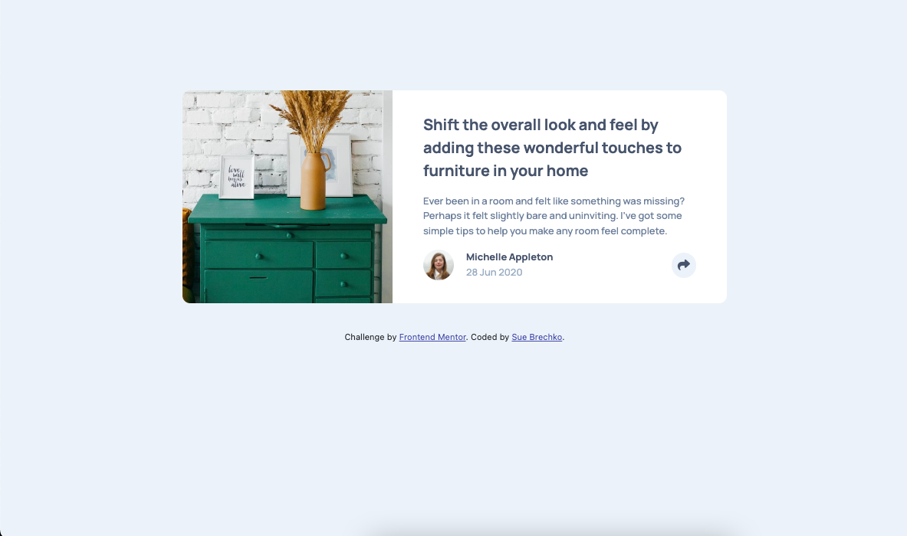
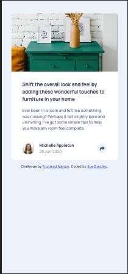

# Frontend Mentor - Article preview component solution

This is a solution to the [Article preview component challenge on Frontend Mentor](https://www.frontendmentor.io/challenges/article-preview-component-dYBN_pYFT). Frontend Mentor challenges help you improve your coding skills by building realistic projects.

## Table of contents

- [Overview](#overview)
  - [The challenge](#the-challenge)
  - [Screenshot](#screenshot)
  - [Links](#links)
- [My process](#my-process)
  - [Built with](#built-with)
  - [Useful resources](#useful-resources)
- [Author](#author)

## Overview

### The challenge

Users should be able to:

- View the optimal layout for the component depending on their device's screen size
- See the social media share links when they click the share icon

### Screenshot

### Links

- Solution URL: https://github.com/shoproizoshlo/article-preview-component-master
- Live Site URL: https://sue-article-preview-component.netlify.app/

## My process

### Built with

- Semantic HTML5 markup
- CSS custom properties
- Flexbox
- Bootstrap

### Useful resources

- [CSS box shadow generator](https://generators.shecodes.io/css-box-shadow-generator)
- [Icols library](https://fontawesome.com/icons/)

## Author

- Frontend Mentor - [@shoproizoshlo](https://www.frontendmentor.io/profile/shoproizoshlo)
- Twitter - [@suereact](https://www.twitter.com/)
